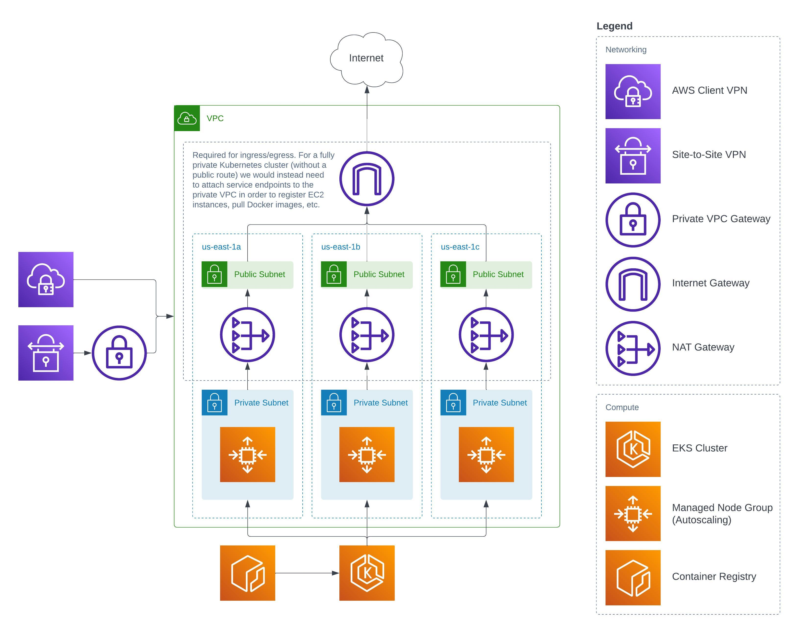

# sk8s

Deploy a simple Kubernetes cluster in a greenfield AWS environment with Terraform. The default configuration creates a VPC with public and private subnets spread across the specified Availability Zones. Egress traffic to the internet is permitted in order to pull down app images, but the EKS cluster and its worker nodes are only accessible from within the VPC. Both Fargate and managed node groups are suported. Because the EKS cluster's API server endpoint is private, you need to have a client or site-to-site VPN connection set up.

In addition to the resources depicted in the following architecture diagram, the Terraform plan also creates a set of IAM roles for letting EKS manage worker nodes and other resources on your behalf, along with route tables for managing network traffic.

## Creating a Client VPN

Instructions for creating a Client VPN in AWS for testing can be found [here](docs/clientvpn-setup.md).

## Installing ARC

Instructions for installing the GitHub Actions Runner Controller on EKS can be found [here](docs/arc-setup.md).

## Pre-requisites
* AWS credentials to authenticate the [terraform provider](https://registry.terraform.io/providers/hashicorp/aws/latest/docs#provider-configuration)
* [An s3 bucket for the terraform backend](https://developer.hashicorp.com/terraform/language/settings/backends/s3) (technically optional, but highly recommended)
* [GitHub credentials](https://github.com/actions/actions-runner-controller/blob/master/docs/authenticating-to-the-github-api.md) for ARC

### Tools
- [Terraform](https://www.terraform.io/downloads.html) (v1.3.1+)
- [kubectl](https://kubernetes.io/docs/tasks/tools/install-kubectl/) (v1.24.0+)
- [helm](https://helm.sh/docs/intro/install/) (v3.7.0+) (optional)
- [aws-cli](https://docs.aws.amazon.com/cli/latest/userguide/install-cliv2.html) (v2.2.0+) (optional)
- [aws-iam-authenticator](https://docs.aws.amazon.com/eks/latest/userguide/install-aws-iam-authenticator.html) (v0.5.3+) (optional)

### AWS
- [AWS-S3](https://aws.amazon.com/s3/) bucket for Terraform state

## AWS Resources

- VPC (public and private subnets, NAT gateways, route tables, etc.)
- IAM roles and policies for EKS
- EKS cluster
- Managed node groups (worker nodes) or Fargate profile
