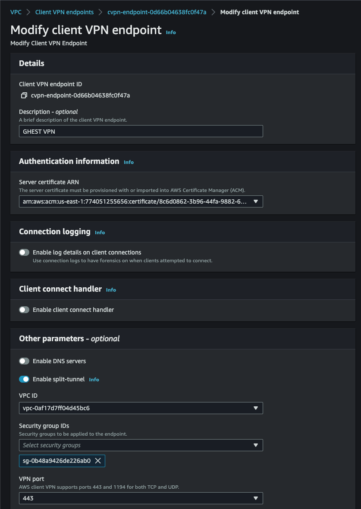
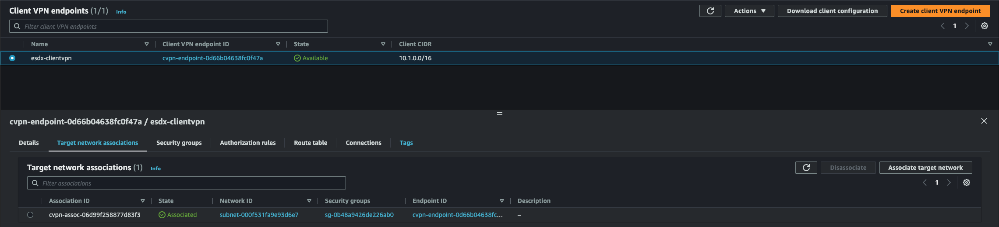
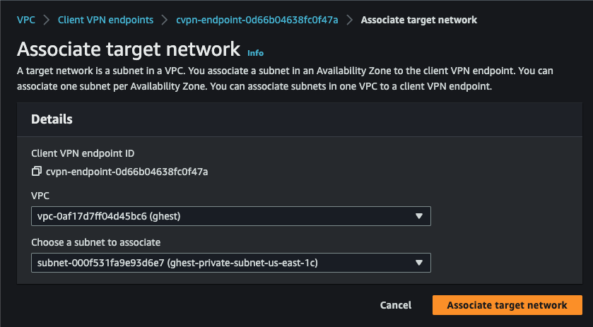
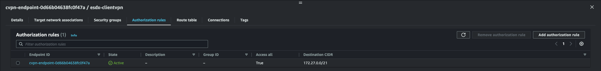
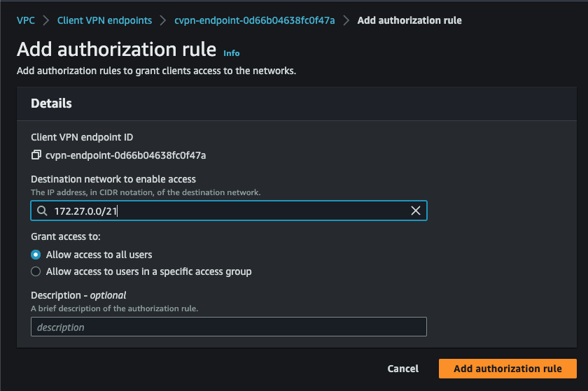
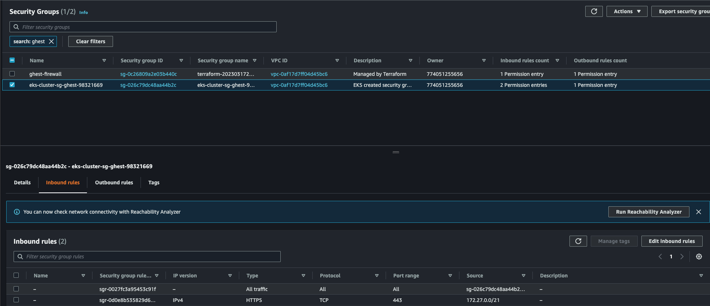

# Client VPN Setup

## Setting up the Client VPN 

For setting up the Client VPN to be used to connect to the EKS cluster we can use pre-existing docs created by AWS. [Client VPN setup](https://docs.aws.amazon.com/vpn/latest/clientvpn-admin/cvpn-getting-started.html#cvpn-getting-started-certs)

### Client VPN Setup Step 1:

1. There is a [OpenVPN easy-rsa mutual authentication](https://docs.aws.amazon.com/vpn/latest/clientvpn-admin/client-authentication.html#mutual) document to help you set up the server/client certificates and keys using the OpenVPN easy-rsa utility.

2. At Step 7 of the `mutual authentication` instructions it prompts you to import client/server certificates and keys to ACM (AWS Management Console) via the AWS cli. 
    -  Use the AWS documentation [Importing a certificate](https://docs.aws.amazon.com/acm/latest/userguide/import-certificate-api-cli.html) to look at alternative methods to import the certificates and keys to ACM.

### Client VPN Setup Step 4-6:
1. For these steps in the `Client VPN setup` you require a VPC that should be configured in the EKS setup. The VPC should be set up within the terraform to build EKS ARC set up so ensure that is up and running before you proceed with these steps. 

2. `Step 5` can be skipped since the authorization rule sets up a routing table to connect to the VPC CIDR in Step 4.

## Connecting using Client VPN using the AWS provided client
1. For this step we need to download and install the [AWS Client VPN](https://aws.amazon.com/vpn/client-vpn-download/).
2. Make a new VPN profile.
    - Go through the documentation on setting up a [new profile](https://docs.aws.amazon.com/vpn/latest/clientvpn-user/connect-aws-client-vpn-connect.html) for your OS version of the AWS client.
3. Make sure the VPC is associated with the client VPN endpoint:

    

4. Create a Target Association:
    - Click on the `Target Network Associations` tab and click on `Associate Target Network`:

    

    - Associate the client VPN with the target VPC:

    

5. Add Authorization Rule:
    - Click on the `Authorization Rules` tab and click on `Add Authorization Rule`:

    

    - Add an authorization rule to permit network traffic to the VPC:

    

6. Add inbound rule to the EKS cluster security group to allow traffic from the VPC:

    
