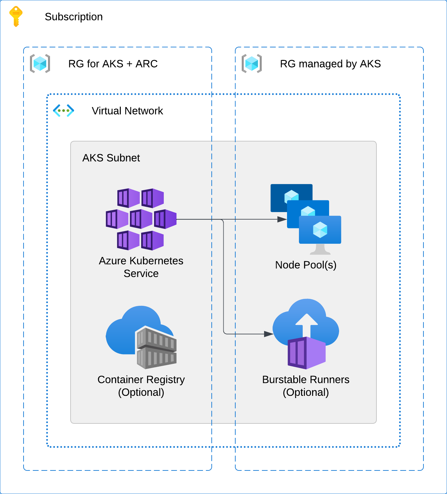

# Azure Kubernetes Cluster Architecture
Containerized GitHub Actions Runners are deployed in a private Azure Kubernetes cluster (AKS). The Kubernetes service is created in one Resource Group, while the infrastructure resources that comprise the cluster itself are provisioned in another RG. All of these resources reside in a single private virtual network with no ingress from the internet. Egress is permitted in order to contact GitHub, download project source code, install required build packages, etc.

The provisioned cluster consists of a default node pool (deployed as a virtual machine scale set) and can leverage Azure Container Instances (ACI) for burstable workloads. This default pool can host critical infrastructure services that have strict uptime requirements, or act as a warm pool of runner instances for jobs  that are executed frequently or on a schedule. The ACI Connector is added to the AKS cluster once it’s made available and spins up additional pods as container instances on demand.

It’s also possible to create additional node pools running as either dedicated Virtual Machine Scale Sets (VMSS) or preemptible instances. This, however, comes with additional operational overhead and isn’t covered in this guide. Reference documentation is provided in case you require certain workloads to be isolated to their own compute resources.

Shown below is a simple representation of the infrastructure components required by a Kubernetes cluster in Azure. If deploying to  In the following sections we’ll examine the core resources utilized by AKS in its operation, and expand to cover ancillary infrastructure for project workloads or ongoing maintenance of the cluster.

## Networking
The network infrastructure laid out in Azure is foundational to AKS. As a container orchestration platform it’s necessary to account for the node pools, container instances, and service endpoints being created as each will be assigned an IP address range from the private virtual network.
A minimum of two subnets is required in order to deploy a Kubernetes cluster: one for the VMs that make up the node pool(s), which is created explicitly, and the other for any services that must be reachable from outside the cluster. The services subnet is declared when creating the cluster but its management falls to Azure; it’s imperative that the CIDR range assigned to the services subnet does not overlap with any existing subnets.

The Kubernetes API server is assigned a private IP address from the same subnet as the default node pool and should be reachable from anywhere deployments to the cluster will be made. Whether pods are assigned IP addresses from this subnet as well depends on what network plugin is chosen, i.e. Kubenet or Azure CNI.

### Kubenet vs. Azure CNI
Kubenet is the basic network plugin used by AKS. Pods are assigned a CIDR range that is only routable within the cluster while load balancers are required for outside connectivity. NATing is used to forward network traffic to the target pods. This helps to conserve IP address space and simplifies network management, but user-defined routes have to be manually maintained.

Azure CNI is often the network management solution chosen for the provisioned AKS cluster. It brings the pods into the private network by assigning IP addresses from the same subnet as the node pool and allows them to be accessed directly. While this necessitates additional planning to avoid IP address exhaustion, it also simplifies network security management and compliance audits as network policies in Kubernetes are implemented by the plugin.

### Fully Private Clusters
As mentioned above, the AKS cluster resources and Kubernetes API server endpoint reside in a private virtual network, but egress from within the cluster is still permitted by default. This may be insufficient to meet stricter security compliance requirements, and if so a fully private cluster is required. This can be accomplished by specifying an alternate outbound egress routing method, i.e. user-defined routing or a user-assigned NAT gateway. Egress traffic can be controlled through network security group rules. For clusters that don’t permit any outside traffic, additional supporting infrastructure must exist for pulling dependencies and storing build artifacts, i.e. a package manager acting as a remote proxy.

## IAM and Role Assignments
The AKS cluster uses a pair of system-assigned managed identities with the permissions necessary to modify the existing network and create the cluster infrastructure listed below. This is enough for a basic Kubernetes cluster configuration, but a user-created service principal is required to take advantage of more advanced features (e.g. the ACI Connector).

The managed identity or service principal assigned to AKS is responsible for creating the node pool VMs, any attached storage devices, and the network links for the Kubernetes API server. Therefore, it must be given Contributor access to the resource group that contains the cluster’s infrastructure resources (this RG is typically prefixed by MC_). When using Azure CNI, this SP must also be granted the built-in role of Network Contributor on the private virtual network.

In order to leverage Azure Container Instances for burstable workloads, a second managed identity must be created with Contributor access to the cluster resource group. As before, when deploying container instances in the virtual private network, the Network Contributor role must also be assigned to the SP.

The table below contains a comprehensive list of all the resources created by the AKS cluster on your behalf using the above SPs.

| AKS Cluster Resources | Purpose |
| --- | --- |
| Load balancer | Used to forward traffic to and from the pods running on the AKS cluster. |
| Managed identity (cluster resources) | Necessary for creating cluster infrastructure in the managed resource group on your behalf. |
| Managed identity (ACI connector) | Necessary for interacting with ACI to spin up container instances on your behalf. |
| Network interface | The network interface/IP address assigned to the private endpoint. |
| Network security group | Firewall rules governing access to the cluster. |
| Private endpoint | Created by AKS so that agent nodes can communicate with the cluster control plane. |
| Private DNS zone | Required for agent nodes to resolve the Kubernetes API server endpoint. |
| Public IP address(es) | For egress to the internet. |
| Virtual machine scale set(s) | A node pool is deployed as a VMSS. |

For access to additional resources like container registries and storage accounts, delegated permissions have to be granted on the resource to the SP.

## Kubernetes RBAC with Azure AD
By default, access to the Kubernetes API, and therefore the ability to deploy services to AKS, is granted to any user on the network. In the case of private clusters, only users with a VPN connection to the private virtual network can access the server endpoint, but this is not enough to guarantee operational security. Enabling RBAC on the cluster grants fine-grained access to cluster resources within a given set of namespaces.

Although the provisioned cluster does not have it enabled by default, RBAC can be switched on by updating the authentication and authorization type in the cluster configuration dashboard or the IaC used to provision AKS. Azure AD integration is supported. Only users that have access to the cluster in Azure would be able to make calls to the Kubernetes API. Furthermore, group memberships would be mapped from AD to Roles already defined in Kubernetes.

## Compute Resources
There are three types of compute resources available in the cluster, each best suited for different use cases. The default node pool is composed of standard virtual machines grouped together in a scale set. These nodes function best as a warm pool for long-lived pods/jobs because they are not preemptible. A warm pool of runners allows some workflows to be executed immediately, thereby reducing wait times for critical jobs or jobs tied to PRs. It can also be scaled out to a maximum number of nodes by provisioning additional VMs as more jobs are executed.

Infrequent jobs that take substantially longer to execute are best scheduled on runner instances in a separate node pool that’s been configured with a minimum node count of zero. This helps to curb spending as there are no idle nodes, and removes any bottlenecks due to running these sorts of jobs in the default warm pool.

Short-lived jobs that may also have a lower priority can be scheduled to run in a pool consisting only of preemptible nodes. As the name suggests, these nodes can be terminated at any time, but consequently offer a significant cost savings.

The last compute resource on which runners can be deployed is Azure Container Instances. ACI eliminates the need to manage node pools explicitly and only charges for the compute time used by the runners. This is an excellent option for burstable workloads; the only drawback is a lack of visibility into the underlying infrastructure. Instead of scheduling pods to run in a node pool managed by AKS, the ACI Connector runs them on a set of virtual nodes that exist apart from the cluster.

### Autoscaling
Horizontal scaling of the AKS cluster is done automatically whenever the scheduler is unable to place a pod on any node. The cluster autoscaler checks the Metrics API server and updates the node count to meet increased demand. Similarly, the Horizontal Pod Autoscaler checks the API server to determine if additional replicas of a given application are required.
